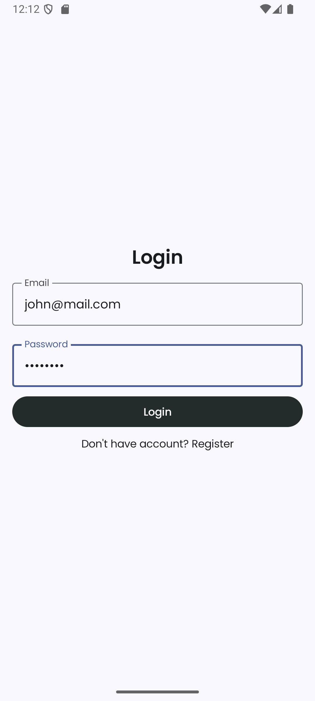
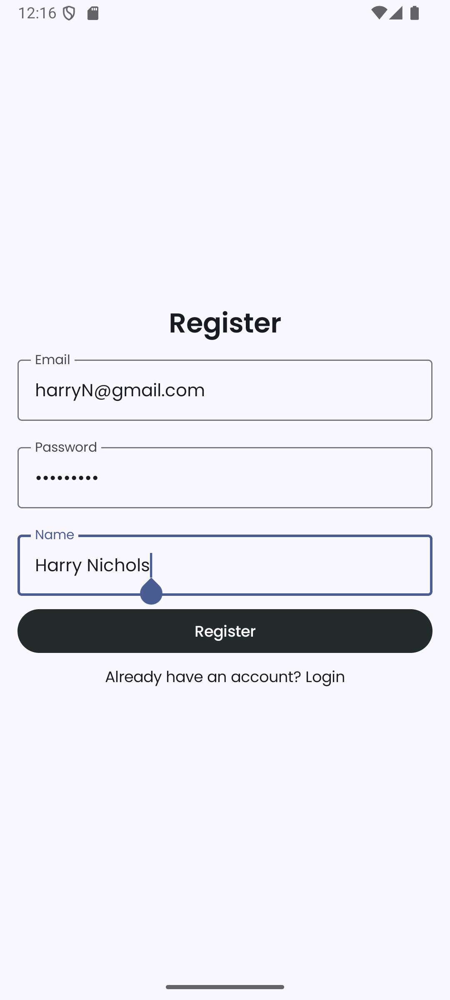
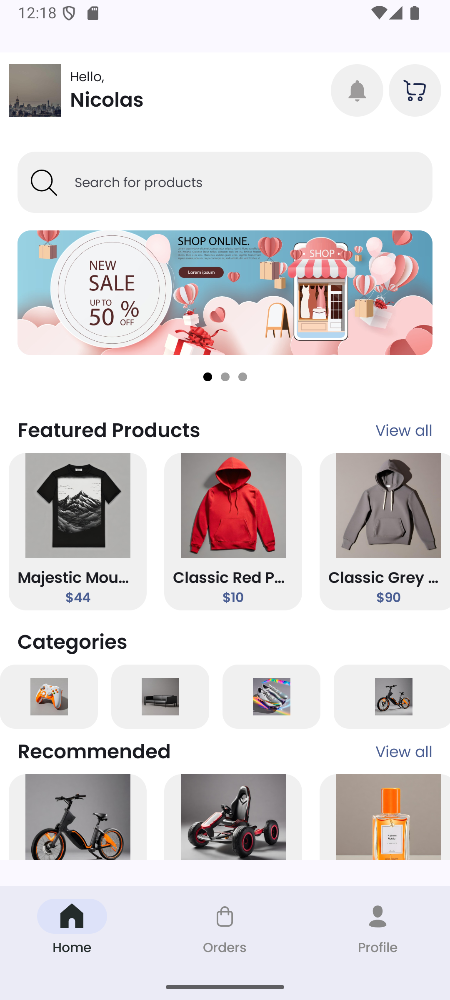
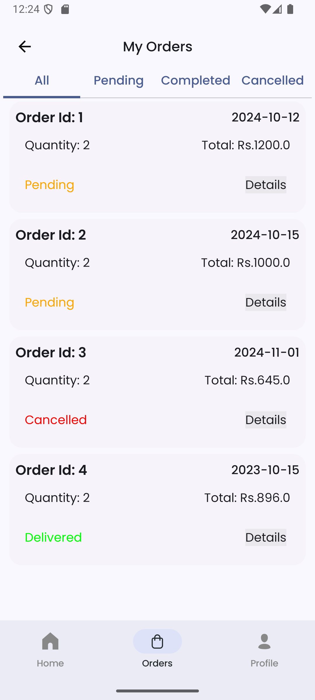
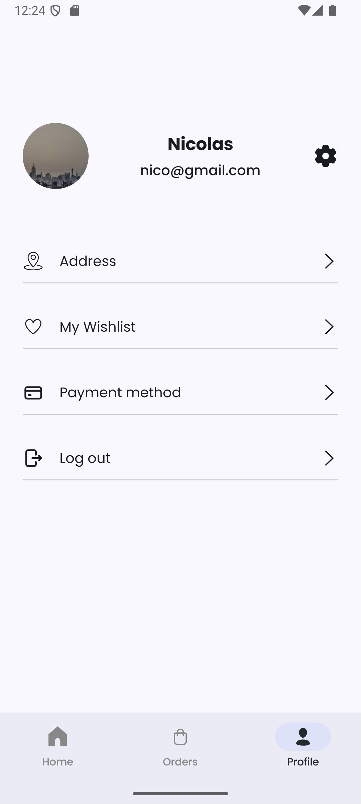
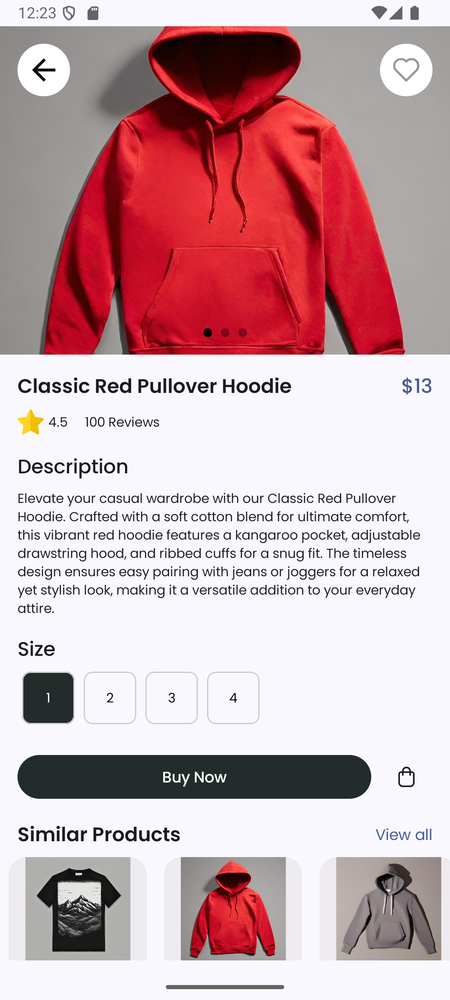
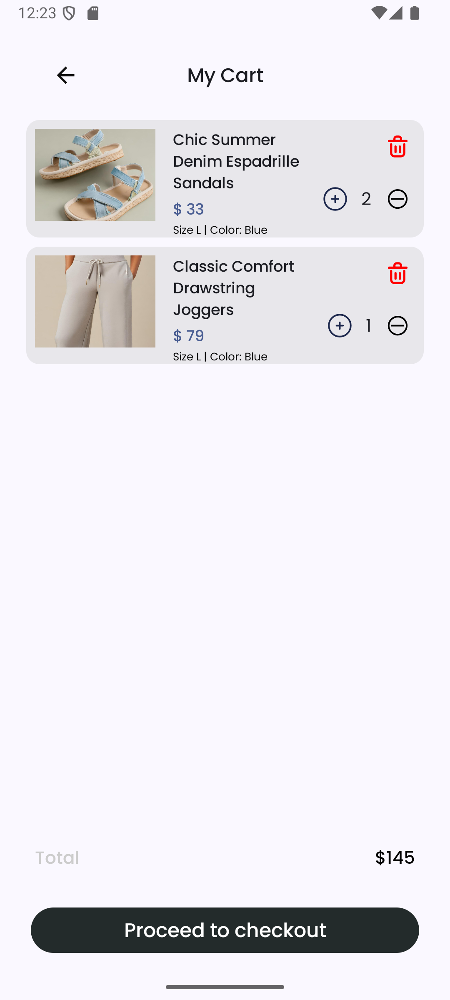

<h1 align="center">📱 E-Commerce Android Application</h1>

<h3>🛠 Built With:</h3>
<ul>
  <li><b>Kotlin</b></li>
  <li><b>Jetpack Compose</b> (Modern UI)</li>
  <li><b>Ktor</b> (HTTP Client)</li>
  <li><b>Koin</b> (Dependency Injection)</li>
  <li><b>Clean Architecture</b> (with abstraction)</li>
</ul>

<h3>📖 Project Overview:</h3>

This E-commerce application allows users to:
<ul>
  <li><b>Login/Register</b> with email and password</li>
  <li><b>Browse Products</b> by categories, featured, and recommended sections</li>
  <li><b>Add Products</b> to Cart and view <b>Cart Summary</b></li>
  <li><b>Check Order History</b> (Previous and Recent Orders)</li>
  <li><b>View and Edit User Profile</b> (Profile Picture, Name, Email, Address)</li>
</ul>
Backend Data fetched from <a href="https://api.escuelajs.co" target="_blank">Platzi Fake Store API</a>.

<h3>📸 Screenshots:</h3>

<table>
<tr>
  <th>Login Screen</th>
  <th>Signup Screen</th>
  <th>Home Screen</th>
  <th>Order Screen</th>
  <th>Profile Screen</th>
  <th>Product Detail Screen</th>
  <th>Cart Screen</th>
</tr>
<tr>
  <td></td>
  <td></td>
  <td></td>
  <td></td>
  <td></td>
  <td></td>
  <td></td>
</tr>
</table>

<h3>🎯 Learning Outcomes:</h3>
<ul>
  <li>Learned how <b>HTTP Requests</b> work using Ktor.</li>
  <li>Understood <b>API Integration</b> with Android UI.</li>
  <li>Applied <b>Dependency Injection</b> using Koin.</li>
  <li>Followed <b>Clean Architecture</b> principles with abstraction layers.</li>
  <li>Abstracted business logic away from UI for better maintainability.</li>
</ul>

<h3>🚀 How to Run:</h3>
<ol>
  <li>Clone the repository</li>
  <li>Open in Android Studio</li>
  <li>Connect your device/emulator</li>
  <li>Click <b>Run</b></li>
</ol>

<h3>▶️ Demo Video (Optional):</h3>

<a href="https://youtube.com/your-demo-link" target="_blank"><b>Watch Demo Video</b></a>

<h3>📛 Repository Name Suggestion:</h3>
<ul>
  <li><code>ecommerce-android-app-kotlin</code></li>
  <li>or <code>E-Commerce App - Kotlin | Jetpack Compose</code></li>
</ul>
